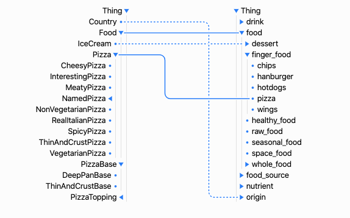

### D2 Data Visualization Lab
# Ontology Class Mapping Visualization
This project is built to conduct a research that compares and evaluates two types of visualization for ontology class mappings.

### Indented Tree
shows a class hierarchy of an ontology as an indented tree.  
 

### Linked Mapping Visualization
shows class mappings as linked lines.  

### Matrix Mapping Visualization
shows class mappings as matrix cells.  
